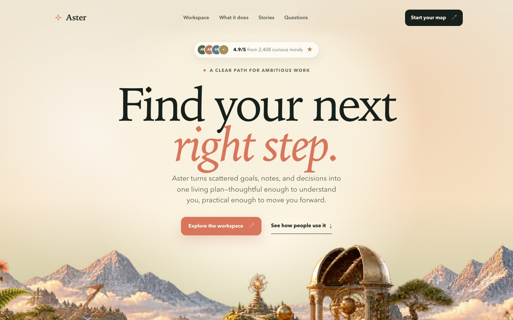

# Aster — cinematic landing-page template

A reusable marketing homepage built around layered alpha artwork and restrained scroll motion. One HTML file, one stylesheet, one script, three images. **No build step, no framework, no dependencies.**

**[Live demo →](https://aster-landing-page-template.pages.dev)**



---

## What you get

| | |
|---|---|
| **Hero** | Three-layer parallax panorama, a rating pill above the headline, and a copy-safe reading aperture that tracks viewport height |
| **Product proof** | A deterministic dashboard mockup in pure HTML/CSS — no screenshots to re-render when your copy changes |
| **Six feature cards** | A 3×2 grid of tinted panels, each holding an original CSS/SVG product stage above its name and description |
| **Comparison table** | Three-column positioning grid, horizontally scrollable on mobile |
| **Reviews, FAQ, closing CTA** | Twelve reviews as social-post cards (avatar, verified tick, stars, date/country) in a masonry wall with a floating count pill; keyboard-operable `<details>` accordion; starfield close |
| **Responsive nav** | Full links on desktop, an accessible dropdown menu below 1000px |

Accessibility: skip link, visible focus rings, `prefers-reduced-motion` honoured throughout, no decorative controls in the tab order, and no meaning carried only by imagery.

## Run it

```sh
python3 -m http.server 4173
open http://localhost:4173
```

That is the entire toolchain. Deploy by copying the folder to any static host.

<details>
<summary>Deploy to Cloudflare Pages</summary>

```sh
npx wrangler pages project create my-site --production-branch main
npx wrangler pages deploy . --project-name my-site
```

`_headers` is included and sets long-lived immutable caching for `assets/`.
</details>

## Make it yours

Work through these five in order. The first two get you 90% of the way.

**1. Brand block.** Everything you must change is fenced in `index.html` between `<!-- TEMPLATE: ... -->` and `<!-- END TEMPLATE brand block -->` — title, description, canonical URL, Open Graph and Twitter cards, favicon, theme colour. Replace `assets/og-image.jpg` (1200×630) and `favicon.svg`. Update `robots.txt` and `sitemap.xml` with your domain.

**2. Design tokens.** Every colour, font, radius, and measure lives at the top of `styles.css`:

```css
:root {
  --canvas: #f4efe5;   --ink: #17201b;    --coral: #d8755a;
  --display: "Iowan Old Style", Palatino, Georgia, serif;
  --sans: "Avenir Next", Avenir, "Segoe UI", Helvetica, Arial, sans-serif;
  --wrap: 1180px;
  --radius-sm: 14px;  --radius-md: 24px;  --radius-lg: 36px;
  --hero-h: clamp(980px, calc(880px + 24svh), 1130px);
  --hero-copy-top: clamp(92px, 13svh, 120px);
  --stage-scale: 0.53;   /* feature stages scale into their cards */
}
```

The default type stack is deliberately system-only — no font request, no layout shift, no third-party origin. Swap in a webfont if you want, but you are trading away the fastest first paint the template has.

**3. Hero artwork.** Replace the three `assets/hero-*.webp` masters, keeping the filenames. They are transparent PNG-sourced panoramas exported to WebP at 2172×724. Keep the subject mass in the lower two-thirds — the upper field is reserved for live copy. `--hero-h` controls how much artwork meets the fold; raise the `24svh` coefficient for more, lower it for less. Each feature stage is authored at a fixed 620×560 and scaled into its card by `--stage-scale`, so you tune one number rather than six layouts.

**4. Copy and links.** Placeholder destinations are marked `data-placeholder-link` in the footer — grep for it and point each one somewhere real before launch.

> **Everything that looks like proof is invented.** The mastheads, the 4.9/5 rating, the review count, and all twelve testimonials are fictional placeholders. Replace them with claims you can actually support, or delete those blocks — shipping them as-is would be fabricating endorsements.

**5. Motion.** Add or remove `data-reveal` and `data-parallax` attributes freely; the engine in `script.js` reads them at load and needs no registration. Everything animates on `transform`/`opacity` only, with a zero-motion final state.

## Design system

`DESIGN.md` documents the visual thesis, the reference ledger, typography and colour decisions with the rejected alternatives, brand invariants, and the QA pass conditions. Read it before making structural changes — it explains *why* the hero reserves its upper field and why product sections cap out well below hero scale.

## Provenance

An original design study. The section rhythm — emotional hero, fast handoff to product evidence, a compact feature grid, comparison, reviews, FAQ, closing CTA — is a widely used marketing structure, informed here by studying [unive.ai](https://unive.ai). No Unive copy, artwork, UI, branding, or proprietary assets are reproduced; Aster is a fictional product with its own world, palette, hierarchy, and graphics.

## License

[MIT](LICENSE) — use it commercially, modify it, ship it. Attribution appreciated, not required.

The hero artwork in `assets/` is generated imagery included under the same terms.
